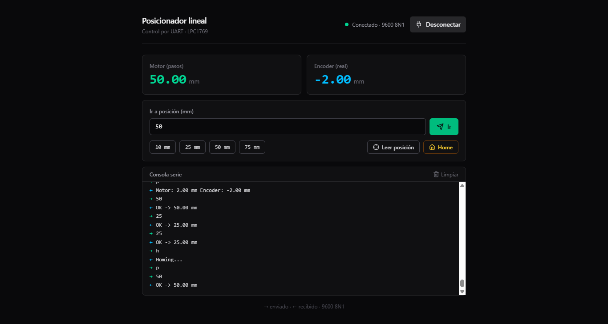

# AXIS-LPC1769 — Posicionador lineal de un eje

**Electrónica Digital III — FCEFyN, Universidad Nacional de Córdoba**

Integrantes: Adriel Omar Scheffer, Daniel Andrés Arias
Profesor: Marcos Javier Blasco

---

## Descripción general

AXIS-LPC1769 es un sistema de **posicionamiento lineal de un eje**, controlado desde una PC, construido sobre la placa **LPC1769** (Cortex-M3).

Un motor paso a paso **NEMA-17**, manejado por un driver **A4988**, hace girar una **varilla roscada de 1 mm/vuelta**. Sobre la varilla, dos tuercas conectadas a un cabezal de impresora guiado por una segunda varilla paralela se desplaza linealmente: cuando el eje del motor gira, la tuerca avanza o retrocede. En el extremo opuesto de la varilla, un **encoder incremental óptico ISC3806 (1000 PPR)** leído por el periférico **QEI** entrega una medición independiente de la posición real, que sirve como verificación del lazo abierto.

En ambos extremos del recorrido hay **finales de carrera** que protegen la mecánica; uno de ellos define el **cero** del sistema. Al arrancar, una rutina de **homing** lleva la tuerca contra ese cero y fija la referencia.

El operador comanda el sistema desde la PC por **UART**: envía posiciones absolutas en milímetros y consulta la posición actual (la que cree el motor y la que mide el encoder). Un **potenciómetro** sobre la placa ajusta en vivo la velocidad de crucero.

---

## Arquitectura del sistema

```
        PC (app web, Web Serial)
                 │  UART 9600 8N1
                 ▼
        ┌──────────────────┐
        │     LPC1769      │
        │  ┌────────────┐  │  STEP/DIR   ┌────────┐   bobinas   ┌─────────┐
        │  │  SysTick   │──┼────────────▶│ A4988  │────────────▶│ NEMA-17 │
        │  │ (rampa)    │  │             └────────┘             └────┬────┘
        │  ├────────────┤  │                                        │ gira
        │  │   QEI      │◀─┼──────── A/B/Z ──────┐                   ▼
        │  ├────────────┤  │                  ┌──┴─────┐      varilla roscada
        │  │  EINT0/1   │◀─┼── finales de ────│ ISC3806│◀──── (1 mm/vuelta)
        │  ├────────────┤  │     carrera      └────────┘            │
        │  │   ADC      │◀─┼── potenciómetro                        ▼
        │  └────────────┘  │                                  tuerca / carro
        └──────────────────┘
```

El **lazo es abierto** (el motor no se corrige con el encoder en tiempo real), pero el encoder permite **verificar** que no se perdieron pasos comparando la posición comandada contra la medida.

---

## Interfaz Gráfica



## Gifs de demostración


## Especificaciones eléctricas

| Parámetro | Valor |
|---|---|
| Tensión de alimentación del motor (VMOT) | 12 V DC |
| Tensión de alimentación lógica | 3.3 V DC |
| Tensión de alimentación del encoder | 5 V DC |
| Corriente máxima por fase del NEMA-17 | ajustada por Vref en el A4988 |
| Pull-ups de las señales del encoder | resistencias externas a 3.3 V |
| Debounce de los finales de carrera | pull-up a 3.3 V + capacitor de 100 nF a GND |

> **Nota de niveles:** las salidas del encoder se llevan a 3.3 V con pull-ups externos. Si el encoder fuera de colector abierto, el pull-up es imprescindible para que el QEI vea flancos limpios. Los pines del QEI (P1.20/23/24) y RXD0 (P0.3) son tolerantes a 5 V; el pin del ADC (P0.23) **no**, por eso el potenciómetro se alimenta a 3.3 V.

---

## Parámetros mecánicos

| Parámetro | Valor |
|---|---|
| Paso de la varilla | 1 mm/vuelta |
| Pasos del motor (paso completo) | 200 pasos/vuelta |
| Resolución teórica (motor, paso completo) | 0.005 mm/paso |
| PPR del encoder | 1000 |
| Decodificación del QEI | 4X |
| Cuentas por mm (encoder) | 4000 cuentas/mm |
| Resolución teórica (encoder, 4X) | 0.00025 mm/cuenta |
| Recorrido total | a confirmar por medición en el banco |

> El A4988 se usa en **paso completo** (MS1/MS2/MS3 a GND), de modo que `STEPS_PER_MM = 200`. La calibración fina de este valor se hace midiendo un desplazamiento conocido con calibre y comparándolo con el encoder.

---

## Herramientas y entorno de desarrollo

| Herramienta | Detalle |
|---|---|
| IDE | MCUXpresso IDE (v25.6) |
| Biblioteca de periféricos | **LPC17xx CMSISv2p00 — versión mejorada** (drivers refactorizados con API moderna: `PINSEL_CFG_T`, `EXTI_CFG_T`, etc.) |
| Compilador | ARM GCC (Redlib, sin semihosting) |
| App de PC | React + Vite + Web Serial API (Chrome/Edge) |

> La biblioteca de periféricos **no es LPCOpen**: es una refactorización de la `CMSISv2p00_LPC17xx` con drivers estandarizadas realizadas por David Trujillo. El módulo QEI conserva los drivers originales (no fue refactorizado), por eso convive con la nueva.

---

## Periféricos del LPC1769 utilizados

- **SysTick:** base de tiempo de **100 µs** (prioridad máxima en el NVIC) que genera los pulsos STEP hacia el A4988. Implementa la rampa de aceleración/deceleración trapezoidal. La rampa está escrita en **aritmética de punto fijo Q8** para evitar el soft-float del Cortex-M3 dentro de la interrupción de tiempo real.
- **QEI:** lectura de posición acumulada y velocidad del encoder ISC3806, en modo cuadratura **4X** con timer de captura de velocidad cada 10 ms.
- **EINT (EINT0/EINT1):** finales de carrera en P2.10 y P2.11, por flanco descendente (lógica negativa). La ISR frena el motor solo si el movimiento va hacia ese tope, y **reconfirma el nivel del pin** para rechazar glitches de ruido.
- **ADC:** lectura del potenciómetro en AD0.0 (P0.23). El valor de 12 bits se mapea a una de 4 velocidades de crucero.
- **UART (UART0):** comunicación serie con la PC a **9600 8N1**. Recepción por interrupción (acumula una línea hasta el Enter); el parseo y la respuesta se hacen en el lazo principal para no bloquear el motor.
- **GPIO:** señales STEP/DIR hacia el A4988 y lectura del nivel real de los finales de carrera (FIOPIN se puede leer aunque el pin esté en modo EINT).
- **NVIC:** prioridades de interrupción. SysTick en prioridad 0 (máxima) para garantizar el timing del generador de pasos; los EINT justo por debajo.

---

## Mapa de conexiones

### Pines del LPC1769

| Señal | Pin | Conecta a |
|---|---|---|
| STEP | P3.26 | A4988 → STEP |
| DIR | P0.0 | A4988 → DIR |
| Final de carrera MAX (+) | P2.10 (EINT0) | switch lejano; otro terminal a GND |
| Final de carrera MIN / cero (−) | P2.11 (EINT1) | switch del 0; otro terminal a GND |
| Encoder A | P1.20 (MCI0) | canal A del encoder |
| Encoder B | P1.23 (MCI1) | canal B del encoder |
| Encoder Z (índice) | P1.24 (MCI2) | canal Z del encoder |
| Potenciómetro | P0.23 (AD0.0) | cursor del pot (extremos a 3.3 V y GND) |
| UART TXD0 | P0.2 | RX del conversor USB-Serie |
| UART RXD0 | P0.3 | TX del conversor USB-Serie |

### Driver A4988

| Pin A4988 | Conecta a |
|---|---|
| STEP / DIR | P3.26 / P0.0 |
| ENABLE | GND (activo bajo) |
| RESET ↔ SLEEP | puenteados entre sí y a 3.3 V |
| MS1 / MS2 / MS3 | GND (paso completo → 200 pasos/vuelta) |
| VDD / GND (lógica) | 3.3 V / GND |
| VMOT / GND (potencia) | 12 V con capacitor de ~100 µF entre VMOT y GND |
| 1A,1B / 2A,2B | los dos pares de bobinas del NEMA-17 |

> **Masa común:** todos los GND (LPC, lógica del A4988, fuente del motor, encoder y potenciómetro) deben estar unidos. Sin referencia común, las señales no significan nada para el micro.

---

## Protocolo de comandos (UART, 9600 8N1)

Cada comando termina con Enter (`\n` o `\r`).

| Envío | Acción | Respuesta |
|---|---|---|
| `<número>` (ej. `40`, `12.5`) | Ir a esa posición absoluta en mm | `OK -> 40.00 mm` |
| `p` | Consultar posición | `Motor: 40.00 mm   Encoder: 39.98 mm` |
| `h` | Rehacer el homing | — |

> Acepta `.` o `,` como separador decimal. La posición del **motor** es la que el firmware infiere de los pasos dados; la del **encoder** es la medida real de la varilla. Compararlas permite detectar pérdida de pasos.

---

## Estructura del repositorio

```
firmware/
├── inc/                 # headers de cada módulo
│   ├── motor.h
│   ├── limit_switches.h
│   ├── encoder.h
│   ├── homing.h
│   ├── pot.h
│   └── comms.h
└── src/                 # implementación
    ├── motor.c          # generador de pasos + rampa + ir a posición
    ├── limit_switches.c # topes por EINT (con filtro de ruido)
    ├── encoder.c        # lectura de posición/velocidad por QEI
    ├── homing.c         # búsqueda del cero
    ├── pot.c            # potenciómetro de velocidad (ADC)
    ├── comms.c          # comandos por UART
    └── main.c           # init + homing + lazo principal
```

Los módulos están desacoplados: cada uno expone una interfaz mínima por su header, y la comunicación entre ellos es por llamadas a función (sin includes circulares).

---

## Compilación y uso

1. Abrir el proyecto en **MCUXpresso IDE** con la biblioteca `CMSISv2p00_LPC17xx` (versión mejorada) en el workspace.
2. Compilar en configuración **Debug** y flashear la placa.
3. Conectar el **UART0** a la PC mediante un conversor USB-Serie (TX→P0.3, RX→P0.2, GND común; no conectar la alimentación del módulo a la placa).
4. **App de PC:** dentro de `pc-app/`, ejecutar `npm install` y `npm run dev`, y abrir el `localhost` **en Chrome o Edge** (la Web Serial API no está disponible en otros navegadores). Pulsar **Conectar** y elegir el puerto del conversor.
5. Al energizar, el firmware ejecuta el **homing** automáticamente; después acepta comandos.

---

## Proceso de integración y desarrollo

1. **Motor:** validación del generador de pasos y la rampa trapezoidal de forma aislada, verificando que el NEMA-17 no perdiera pasos en arranque y frenado.
2. **Encoder:** integración del QEI y verificación de la lectura de posición/velocidad contra desplazamientos de distancia conocida.
3. **Finales de carrera + homing:** topes por EINT con frenado direccional y antitrabado; rutina de homing que fija el cero y retrocede un margen para liberar el switch.
4. **ADC:** lectura del potenciómetro y selección de las 4 velocidades de crucero.
5. **UART:** protocolo de comandos y telemetría, con recepción por interrupción que no introduce latencia en el control del motor.
6. **App de PC:** panel de control por Web Serial (conectar, mover, homing, leer posición, consola serie).
7. **Integración final:** pruebas de movimiento completo (homing + desplazamiento a posición + retorno) y calibración de `STEPS_PER_MM` con calibre y encoder.

---

## Posibles etapas siguientes

- **Límite por software:** medir el recorrido total y rechazar pedidos fuera de rango con un mensaje de error.
- **Lazo cerrado PID:** evolucionar del lazo abierto (con verificación por encoder) a un control PID que corrija desviaciones ante perturbaciones.
- **Mejora mecánica:** reemplazar la varilla roscada por un husillo a bolas para reducir fricción y backlash.
- **Memoria no volátil:** guardar la posición en EEPROM para evitar el homing tras un corte de energía.
- **Interfaz gráfica ampliada:** gráficos en tiempo real de posición/velocidad (motor vs encoder) y registro de datos.
- **PCB dedicada:** migrar de protoboard a un impreso con planos de masa separados (digital/potencia), desacople distribuido y ruteo cuidado de las señales del encoder (criterios básicos de EMC).